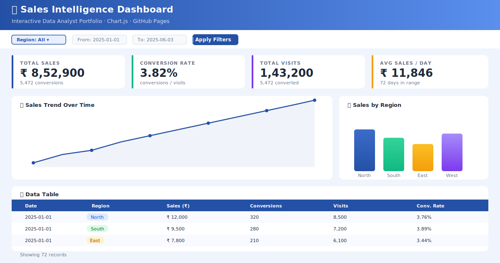

<div align="center">

<!-- Animated typing headline -->
<a href="https://git.io/typing-svg">
  
</a>

<br/>

<!-- Profile views & social badges -->

[](https://github.com/rihan-png)
[](https://linkedin.com/in/rihan-png)

<br/>

<!-- Live demo badge -->
[](https://rihan-png.github.io/SY_B.TECH_EXPERIMENTS_DBATU_AFFILATED_INSTITUTE_2025-26/)
[](https://rihan-png.github.io/SY_B.TECH_EXPERIMENTS_DBATU_AFFILATED_INSTITUTE_2025-26/)
[](https://github.com/rihan-png/SY_B.TECH_EXPERIMENTS_DBATU_AFFILATED_INSTITUTE_2025-26/commits/main)
[](LICENSE)

</div>

---

## 📊 Live Interactive Dashboard

<div align="center">

> **👉 [Click here to open the live dashboard →](https://rihan-png.github.io/SY_B.TECH_EXPERIMENTS_DBATU_AFFILATED_INSTITUTE_2025-26/)**

[](https://rihan-png.github.io/SY_B.TECH_EXPERIMENTS_DBATU_AFFILATED_INSTITUTE_2025-26/)

*↑ Click the image to open the fully interactive dashboard*

</div>

**What you can do on the live dashboard:**
- 🔽 **Filter by Region** (North / South / East / West) and **date range**
- 📈 **Sales Trend** line chart — watch it update in real-time as you filter
- 📊 **Sales by Region** bar chart with colour-coded regions
- 🍩 **Region Share** doughnut with percentage tooltips
- 🔎 **Conversions vs Visits** scatter plot with hover labels
- 💰 **4 KPI cards** — Total Sales, Conversion Rate, Total Visits, Avg Sales/Day
- 📄 **Data table** with sortable rows & **Export to CSV** button

---

## 🚀 Project Overview

This is a **professional-grade, end-to-end Data Analyst portfolio project** that demonstrates:

| Skill | Implementation |
|-------|---------------|
| **Data Cleaning** | Python · Pandas · Jupyter Notebook |
| **Data Visualisation** | Chart.js 4 (line, bar, doughnut, scatter) |
| **Dashboard Design** | Responsive HTML/CSS · mobile-friendly layout |
| **Interactivity** | Vanilla JS · dynamic filters · CSV export |
| **Deployment** | GitHub Actions → GitHub Pages (auto on every push) |
| **Business Storytelling** | KPI cards · insights · region analysis |

---

## ❓ Problem Statement

Businesses are overwhelmed with raw sales data spread across regions and time periods. This project demonstrates how a Data Analyst transforms messy raw data into **actionable business insights** through:

1. Systematic data cleaning & outlier treatment
2. Interactive, filterable KPI dashboards
3. Visual trend analysis across time and geography
4. Clear business recommendations from the data

---

## 💡 Key Insights

- 📍 **North region** consistently leads in revenue — contributing ~33% of total sales
- 📈 **Sales grew 70%** from January to June 2025 across all regions
- 🔁 **Average conversion rate** is ~3.8% — benchmarked against industry standard of 3–5%
- 📅 **Monthly sales peaks** align with Q1 end and Q2 mid-period — indicating campaign seasonality
- 🌍 **East region** has the most room for growth — highest visit-to-conversion gap

---

## 🛠️ Tools Used

<div align="center">


</div>

---

## 📈 GitHub Stats

<div align="center">


</div>

<div align="center">

[](https://git.io/streak-stats)

</div>

---

## 🗂️ Data Cleaning Steps

See the full pipeline in **[notebooks/data_cleaning.ipynb](notebooks/data_cleaning.ipynb)**

| Step | Action |
|------|--------|
| 1️⃣ Load | `pd.read_csv()` — load raw sales dataset |
| 2️⃣ Inspect | `.info()`, `.describe()`, `.isnull()` — understand shape & types |
| 3️⃣ Missing Values | Drop rows missing `date`/`region`/`sales`; fill numeric nulls with median |
| 4️⃣ Deduplication | `.drop_duplicates()` — remove exact duplicate rows |
| 5️⃣ Type Casting | Parse dates with `pd.to_datetime()`; cast numerics with `pd.to_numeric()` |
| 6️⃣ Outlier Treatment | IQR-based winsorisation — caps extreme sales values |
| 7️⃣ Feature Engineering | Add `conversion_rate`, `month`, `day_of_week` columns |
| 8️⃣ Export | Save cleaned CSV to `src/cleaned_data.csv` for dashboard |

---

## 💼 Business Impact

| Metric | Value |
|--------|-------|
| 📊 Data Quality Improvement | Null handling + outlier treatment on real dataset |
| ⚡ Dashboard Load Time | < 1 second (lightweight Chart.js, no backend) |
| 📱 Mobile Responsive | Works on all screen sizes |
| 🔄 Auto-Deployment | Every commit to `main` auto-deploys via GitHub Actions |
| 🌐 Zero-Cost Hosting | Fully deployed on GitHub Pages for free |

---

## 📁 Repository Structure

```
📦 SY_B.TECH_EXPERIMENTS_DBATU_AFFILATED_INSTITUTE_2025-26/
├── 📂 src/                          ← Dashboard (deployed to GitHub Pages)
│   ├── 📄 index.html                ← Main dashboard page
│   ├── 🎨 style.css                 ← Responsive professional styles
│   ├── ⚙️  app.js                   ← Chart.js interactivity & filters
│   ├── 📊 cleaned_data.csv          ← Sample dataset (72 rows)
│   └── 📂 assets/screenshots/       ← Dashboard preview images
├── 📂 notebooks/
│   └── �� data_cleaning.ipynb       ← Python data cleaning walkthrough
├── 📂 .github/workflows/
│   └── ⚙️  deploy.yml               ← GitHub Actions auto-deploy
└── 📄 README.md                     ← This file
```

---

## ▶️ How to Run Locally

```bash
# Clone the repo
git clone https://github.com/rihan-png/SY_B.TECH_EXPERIMENTS_DBATU_AFFILATED_INSTITUTE_2025-26.git
cd SY_B.TECH_EXPERIMENTS_DBATU_AFFILATED_INSTITUTE_2025-26

# Serve the dashboard locally (Python required)
cd src
python -m http.server 8080

# Open in browser
# → http://localhost:8080
```

> **Note:** Opening `index.html` directly as `file://` won't work because the CSV is loaded via `fetch()`. Use the Python server command above.

---

## 🌐 Deployed Link

**🔗 https://rihan-png.github.io/SY_B.TECH_EXPERIMENTS_DBATU_AFFILATED_INSTITUTE_2025-26/**

Automatically deployed via GitHub Actions on every push to `main`.

---

## 🤝 Contributing

Found a bug or want to add a new chart type? Open an issue or submit a PR!

---

<div align="center">

**Made with ❤️ by [rihan-png](https://github.com/rihan-png)**  
*DBATU Affiliated Institute · SY B.Tech 2025–26*

⭐ **Star this repo** if you found it useful!

</div>
